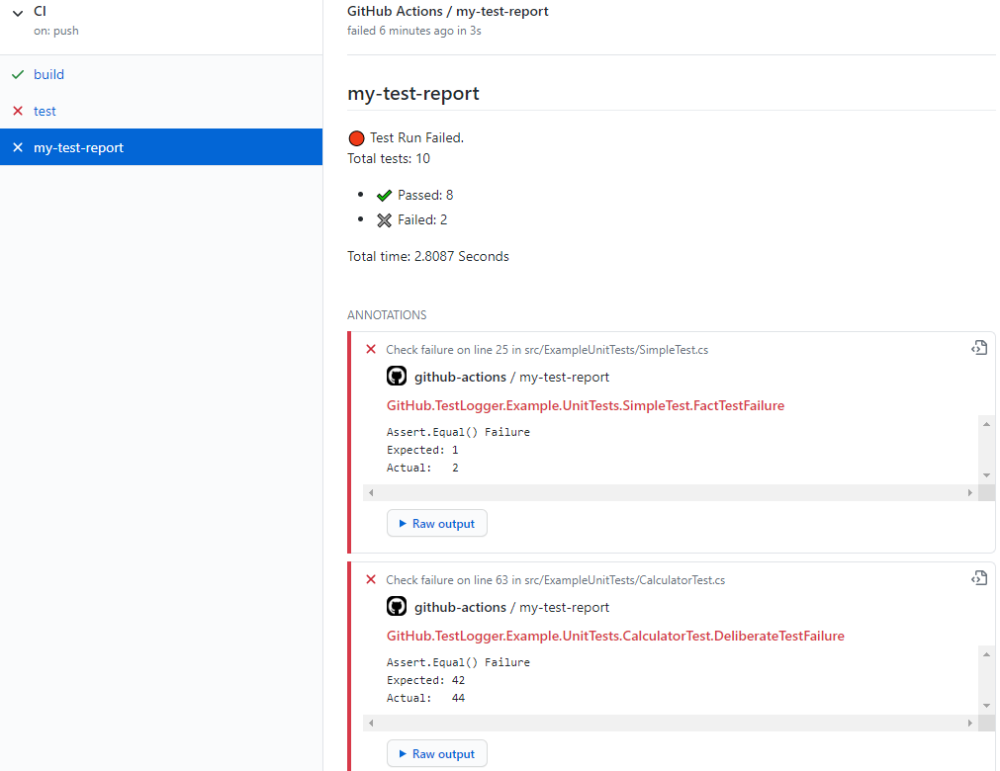

# GitHub Test Logger
GitHub logger extensions for [Visual Studio Test Platform](https://gtihub.com/microsoft/vstest).

 |Builds | [](https://github.com/dogguts/githubtestlogger/workflows/CI) | [](https://github.com/dogguts/githubtestlogger/workflows/Release)
| ----- | ----- | ----- | 

---

---

## Packages
|   |  Stable   |   CI |
| - | -------------- | -------------- | 
| GitHub.TestLogger |  | [GPR](https://github.com/dogguts/githubtestlogger/packages/297979) |

## Usage
Github logger can report test results automatically to your GitHub workflow. 

:warning: This logger can only be used from within a GitHub workflow, since it requires several environment variables provided by GitHub to access the GitHub Api.

See an example: [githubtestlogger-example](https://github.com/dogguts/githubtestlogger-example)

### Add a reference to the GitHub Logger nuget package in your test project:
```Powershell
#Package manager
Install-Package GitHub.TestLogger -Version 1.0.0
```
or
```sh
#CLI
dotnet add package GitHub.TestLogger --version 1.0.0
```
### Use the following command line in tests
```sh
dotnet test --logger "github;GITHUB_TOKEN=${{secrets.GITHUB_TOKEN}}"
```

### Parameters
Parameters can be set with the command line, or through Environment variables.
| Name  |  Parameter   | Environment |   | Default |
| ----- | ------------ | --- | - | ------- |
| Github token (mandatory)| GITHUB_TOKEN | [N/A] | The github token that will be used to access the GitHub Api to publish the test results. Usually _${{secrets.GITHUB_TOKEN}}_ |
| Name (optional) | name         | GHL_CHECKRUN_NAME | The job name the test report will be published under. | test-report |

Eg. to publish test result with name "my-test-report":
```sh
dotnet test --logger "github;name=my-test-report;GITHUB_TOKEN=${{secrets.GITHUB_TOKEN}}"
```

## LICENSE

